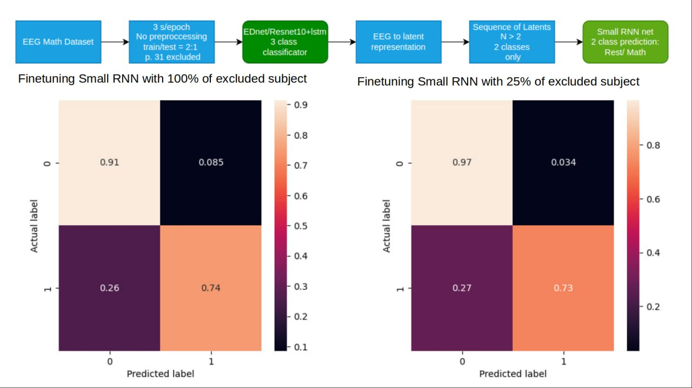

# Predicting states from EEG recordings of multiple subjects in two steps using two models. First model is used as feature extractor and second model predict state from sequence of latent vectors generated by first model.

## Motivation
Classifying EEG recordings of multiple participants into three classes can be challenging and transferring these classifications to new participants presents an even greater challenge. To address this issue, this repository takes a multi-step approach. Firstly, a feature extraction network is trained; afterwards, another model is trained and finetuned to classify EEG states of any additional participant, exclusively utilizing the latent vectors produced by the initial training process. By breaking down the classification task into these two steps, this approach attempts to achieve higher accuracy while ensuring applicability to novel participants using relatively small models.


## Dataset
The dataset contains EEG recordings from 20 individuals (named from 25 to 44). The participants underwent two different mathematical tasks or remained at rest for a total of 18 states, each state lasting approximately 30 seconds. The continuous recording was segmented into 3-second intervals with three corresponding labels: rest, performing the first math task (scroll), and performing the second math task. It should be noted that the recordings are unprocessed, without reference signals or standardization(normalization).

EEG dataset files format: `x_{subject_number}_{segment number}.npy` for eeg segments and `{subject_number}_y.npy` for eeg states labels. 

Download Dataset [here](https://drive.google.com/file/d/1MWoCCB-kb7JPFBDce668kTTEtUV3w-xI/view?usp=sharing) and put in data folder.

## Results 
<div align=center>  </div>
So far using two step approach we were able to reach from 0.64 to 0.9 accuracy predicting two classes at 
the second step using 5 latent vectors sequence. 


All subjects cross-validation resuls (best one of 3 reruns):

| Subject | Accuracy | Subject | Accuracy | Subject | Accuracy | Subject | Accuracy | 
| --- | --- | --- | --- | --- | --- | --- | --- | 
| 25 | 0.68 | 30 | 0.81 | 35 | 0.74 | 40 | 0.8 |
| 26 | 0.78 | 31 | 0.8 | 36 | 0.66 | 41 | 0.74 |
| 27 | 0.86 | 32 | 0.9 | 37 | 0.67 | 42 | 0.64 |
| 28 | 0.89 | 33 | 0.84 | 38 | 0.86 | 43 | 0.64 |
| 29 | 0.81 | 34 | 0.86 |  39 | 0.73 | 44 | 0.74 |


## Quick Start
Download dataset

Install dependencies

Open `EEG_to_rest_n_tasks.ipynb` and follow step by step.

## Dependencies
See requirements in `requirement.txt`

```sh
pip install -r requirements.txt
```


## Settings and Models 
Select which participant should be excluded from the train set of first model by changing
```python  
test_subj = [31] # should be in range from 25 to 44
```
For the feature extractor model one of two architectures can be used:
1. Our reimplementation of Resnet 18 model (all 2 conv layers replaced to 1d convs) appended with LSTM layer 
2. Custom Envelope Detector model (ED-net)

This can be changed by 
```python  
TEST_MODEL = 'resnet' #  for some participants perform slightly better with longer trainnig 
#TEST_MODEL = 'ednet'
```

Both models described in detail in:
```
@article{petrosyan2022,
title = {Speech decoding from a small set of spatially segregated minimally invasive intracranial EEG electrodes with a compact and interpretable neural network},
author = {Artur Petrosyan and Alexey Voskoboinikov and Dmitrii Sukhinin and Anna Makarova and Anastasia Skalnaya and Nastasia Arkhipova and Mikhail Sinkin and Alexei Ossadtchi},
journal = {Journal of Neural Engineering},
doi = {10.1088/1741-2552/aca1e1},
url = {https://dx.doi.org/10.1088/1741-2552/aca1e1},
year = {2022},
}
```

